# car-vision

[](https://github.com/dkurokawa/car-vision-demo/actions/workflows/ci.yml)

車外観の 4 角度クラス (left_front / left_rear / right_front / right_rear) を分類する
フルスタックプロジェクト. 学習は GPU (RTX5080) 上の Docker, 推論は
ONNX Runtime Web を使ったブラウザデモ.

---

## データソース

公開データセット & フリー素材 API のみを使用 (詳細・ライセンスは
[data/EXTERNAL_DATASETS.md](data/EXTERNAL_DATASETS.md) を参照):

| 種別 | ソース | ライセンス |
|------|--------|-----------|
| 外観画像 | Unsplash / Pexels / Pixabay API | 各サービスのライセンス |
| 外観画像 | [EPFL Multi-View Car Dataset](https://www.epfl.ch/labs/cvlab/data/data-pose-index-php/) | 研究用途限定。画像は本リポに含めない |
| 外観画像 | [Stanford Cars Dataset](http://ai.stanford.edu/~jkrause/cars/car_dataset.html) | 研究用途限定。画像は本リポに含めない |
| 外観画像 | [Kaggle 公開データセット](https://www.kaggle.com/) | データセット毎に異なる。画像は本リポに含めない |

---

## 構成図



公開画像 API から出典付きで画像を集め、手でクラスに振り分けて分割し、手元の GPU（Docker + CUDA）で YOLOv8-cls を学習する。ONNX に書き出して、ブラウザ（onnxruntime-web）で推論する。画像と学習済みモデルはこのリポジトリに含めない。

## 構成

```
car-vision/
├── data/                    # データ収集と前処理
│   ├── scripts/            #   公開ソースからの収集スクリプト
│   └── raw/exterior/       #   クラス別画像 (left_front / left_rear / right_front / right_rear)
│
├── training/                # YOLOv8-cls 学習 (Docker + CUDA)
│   ├── Dockerfile          #   pytorch:cuda ベース
│   ├── scripts/            #   train.py / split_dataset.py / classes.py / prepare_dataset.sh / start_training.sh
│   └── docker-compose.yml
│
└── apps/
    └── inference-demo/      # Vite + React + onnxruntime-web
```

---

## モデル・データ管理

学習済みモデル (`*.pt` / `*.onnx`) と収集画像 (`data/raw/`) は本リポジトリに含めない.
手元でデータを収集し、学習して `apps/inference-demo/public/models/` に生成物を置く
(下のクイックスタート参照)。

---

## クイックスタート

### 1. データ収集

```bash
# .env に各 API キーを設定 (UNSPLASH_ACCESS_KEY / PEXELS_API_KEY / PIXABAY_API_KEY)
uv run --extra data python data/scripts/download_datasets.py --target 200
# → data/raw/exterior/_unsorted/<class>/ に保存され、
#   data/raw/exterior/manifest.csv に出典 (source/author/license/URL) を記録する
# --target はクラスあたりの総目標枚数. 既存分を数えて不足分だけ取得する
# クラス振り分けは別途手動で行う (_unsorted/<class>/ → <class>/)
```

### 2. 学習 (RTX5080)

```bash
# ホスト: 実際の振り分け先フォルダをクラスとして train/val/test に分割
# (詳細・fingerprint による再利用条件は training/README.md)
bash training/scripts/prepare_dataset.sh

# CUDA が使える GPU ホスト: Docker 起動
cd training
docker compose up --build
```

出力:
- `training/runs/classify/exterior_angle/weights/best.pt`
- `training/models/exterior_angle.onnx`

### 3. ブラウザ推論デモ

```bash
cp training/models/exterior_angle.onnx apps/inference-demo/public/models/
cd apps/inference-demo
npm install
npm run dev
```

品質チェック:

```bash
npm run lint   # eslint (typescript-eslint strictTypeChecked)
npm test       # vitest
npm run build  # tsc -b && vite build (モデル無しでも通る)
```

---

## ライセンス

コード: [MIT](LICENSE) / データ: 各ソースのライセンスに準拠 ([data/EXTERNAL_DATASETS.md](data/EXTERNAL_DATASETS.md)).
